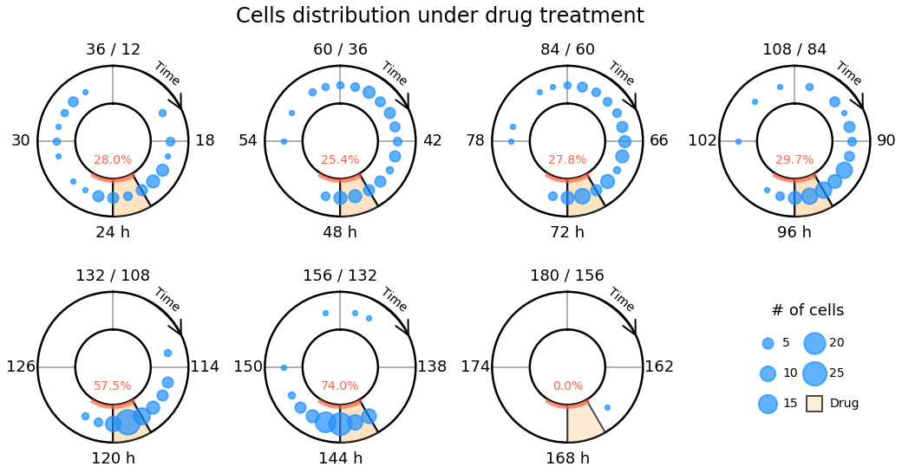
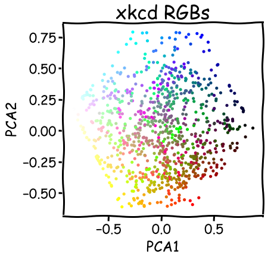
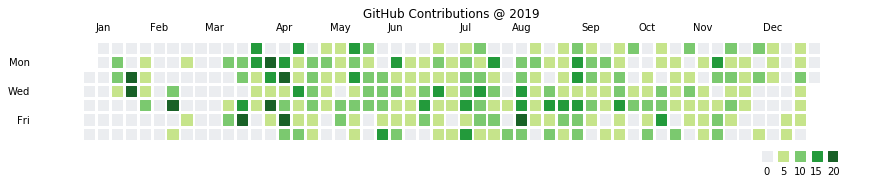
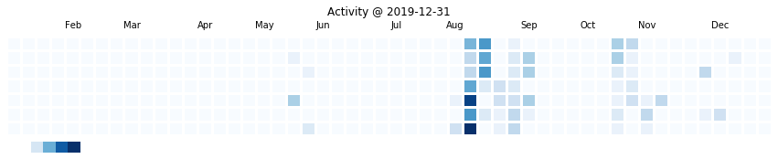

# OpenFig

**Open Source Figure & Code**
---

## [Clock](./Clock)

**Figure for Paper**

- Paper links: [DOI](https://doi.org/10.1039/D0LC00140F)
- Cells distribution under drug treatment
- Keywords: **Polar**, **TimeData**

---

## [xkcd_rgbs](./xkcd_rgbs)

**Pick colors from xkcd colors list**

- PCA demonstration [xkcd colors](https://xkcd.com/color/rgb/)
- Hand pick 20 colors and 6 VIPs
- Confusion matrix for 20 colors :pushpin:

---

## [GitHub_contributions](./GitHub_contributions)

**Plot GitHub/Kaggle Contributions/Activity (get data from web)**

- GitHub

- Kaggle

---
